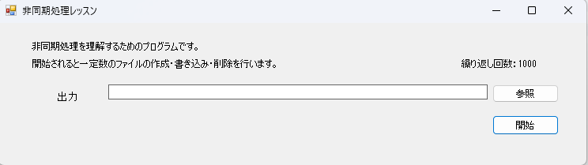
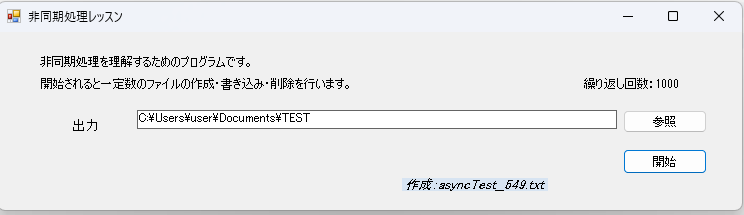

# 🌀 practiceAsync - WinForms 非同期処理レッスン

このプロジェクトは、C# Windows Forms を使った **非同期処理 (async/await)** の学習用レッスンです。  
ファイルの作成・書き込み・削除を非同期で実行しながら、UI スレッドとの安全なやり取り（`Invoke` の使い方）を学べます 💡

---

## 📁 機能概要

- テキストファイル N 個を作成（現在1000個を設定）
- 各ファイルにランダムなパスワード文字列を書き込み
- その後ファイルを一括削除
- 処理の進捗は `Label` コントロールにリアルタイム表示
- UI スレッドとの安全な同期のため、`Invoke` によるスレッド処理制御を導入

---

## 🏗️ 開発環境

- Visual Studio 2022 以降（.NET Framework プロジェクト）
- C# WinForms アプリケーション
- .NET Framework 4.7.2 以上推奨

---

## 🖥️ アプリ画面

非同期処理アプリの起動時の画面：

実行中の画面：

